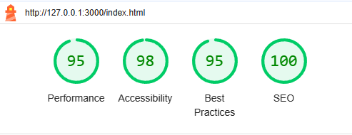

# Hudson Business Travel - Milestone Project 1

## HTML/CSS Essentials - User Sentric, Centric Front-End Website

## Hudson Business Travel

Hudson Business Travel has established itself as a frontrunner in the corporate travel industry, offering bespoke travel solutions tailored to meet the unique demands of professionals and businesses. Expert in navigating the intricacies of business travel, the company specialises in efficiently managing everything from urgent trips to complex travel itineraries, always focusing on client comfort and convenience. Their commitment to customer-centricity ensures that each travel plan is more than a journey; it’s a customised experience designed to align with their client’s specific business and personal needs.

At the core of Hudson Business Travel’s ethos is a relentless drive for innovation. They integrate the latest technology in travel management, providing advanced booking systems and real-time itinerary tracking to ensure clients are always a step ahead. Hudson Business Travel is synonymous with excellence and integrity in the corporate travel sector, offering more than just travel arrangements. They are a committed partner in their clients’ professional journeys, ensuring every trip is smooth, efficient, and perfectly aligned with business objectives.

*Please note that Hudson Business Travel is a fictional entity, created specifically for my Milestone Project 1.*

Click [Here](https://ty-thetravelguy.github.io/hudson-business-travel-milestone-project-1/) to view the webpage.

## Table of contents

1. [Business Needs](#business-needs)

2. [User Needs](#user-needs)

3. [Design Process](#design-process)

    1. [Process](#process)

    2. [Colour Palette](#colour-palette)

    3. [Wire Frame](#wire-frame)

        1. [Web Layout](#web-layout)

        2. [Tablet Layout](#tablet-layout)

        3. [Phone Layout](#phone-layout)

4. [Technoligy used](#technology-used)

5. [Testing](#testing)

6. [Issues/Bugs](#issuesbugs)

7. [Deployment](#deployment)

8. [Credits](#credits)

## Business Needs

1. Brand Awareness: In today's digital era, an online presence is crucial for reaching a wider audience. A website increases brand visibility and recognition, making Hudson Business Travel known to potential clients who rely on the Internet for corporate travel solutions. It's essential for expanding the company's reach beyond traditional boundaries.
2. Professional Image: A website is often the first point of interaction between a company and its potential clients. A well-designed website conveys a sense of professionalism and legitimacy. It reinforces Hudson Business Travel's image as a reliable and established player in the corporate travel sector, which is vital for building trust with prospective clients.
3. Informational Resource: Providing comprehensive information about services, expertise, and company values is vital to engaging potential clients. A website acts as an always-accessible repository of information, allowing Hudson Business Travel to effectively communicate its offerings, ethos, and strengths, which is essential in informing and attracting potential clients.
4. First Point of Contact: The website is a primary interface for initial enquiries. In a business where first impressions matter, a well-crafted website serves as the initial handshake, offering a glimpse into what Hudson Business Travel is about and how it operates. This is crucial for establishing a positive initial rapport with potential clients.
5. Marketing and Promotion: A website is a powerful marketing tool. It allows Hudson Business Travel to showcase its services and highlight its unique selling points or achievements. In a competitive market, this platform is essential for standing out and effectively communicating the value proposition to potential clients.
6. Competitive Edge: A strong online presence is no longer just an option but a necessity for staying competitive. A website ensures that Hudson Business Travel keeps up with or stays ahead of competitors, demonstrating its commitment to modern business practices and meeting the expectations of digitally savvy clients.

## User Needs

1. Understanding of Services Offered: Users require clear, concise information about the services provided by Hudson Business Travel, such as types of travel management services and support provided.
2. Company Insight: Potential clients and partners look for insights into the company’s ethos and the team’s expertise to gauge reliability and fit.
3. Contact Information: Easy access to contact information is crucial for users considering Hudson Business Travel’s services.
4. Simple Navigation: A user-friendly website design with simple navigation is essential, allowing users to quickly find the information they need.
5. Corporate Identity and Branding: Users expect the website to reflect the corporate identity of Hudson Business Travel, with professional design and branding that aligns with the company’s image and market position.
6. Sustainability Commitment: Hudson Business Travel wants to showcase its commitment to eco-friendly travel, aligning with industry trends towards environmental responsibility and positioning itself as a progressive, eco-conscious leader in the sector.

## Design Process

### Process

To effectively meet our business goals and cater to the needs of our users, I have planned a four-page, responsive website design. This ensures optimal viewing and interaction experience across all devices, maintaining aesthetics and functionality regardless of screen size.

*Home Page*: Business Travel’s Home Page is designed for immediate impact and user engagement. It features a top navigation bar for seamless site navigation and a compelling hero image that captures the essence of corporate travel. Prominently displayed on the right side of the image is the bold question, “Looking for a new travel management company?” accompanied by a ‘Contact Us’ button to prompt user action. Below this, the “Why Choose Business Travel” section outlines the company’s unique selling points. The footer, consistent across the website, includes social media links and contact details, offering users multiple ways to connect with the company.

I decided to add a video to my project after I completed everything because they can significantly enhance user engagement and convey your message more effectively. Videos are often more engaging and memorable than text or static images. Please note the video is AI generated which I loaded into YouTube.

*What We Do Page*: This page introduces visitors to the services offered by Business Travel with a header image that sets a professional tone. It includes a detailed section on the company’s services, followed by the “Expertise” area showcasing interactive images. These images, when clicked, reveal more information about specific service areas, enhancing user interaction. The footer, matching the homepage, provides a mix of social media and contact details, ensuring easy access for visitors seeking more information or ways to connect.

*Sustainability Page*: A dedicated Sustainability page, visually introduced by a plant image symbolising commitment to environmentally responsible travel. This page succinctly presents the company’s eco-friendly initiatives and collaboration with Carbon Neutral Britain, emphasising their focus on sustainable corporate travel solutions. Consistent with the site’s design, the footer on this page contains social media links and contact information, offering easy connectivity and further engagement opportunities for users.

*Who We Are Page*: The ‘Who We Are’ page starts with a consistent header image, maintaining the website’s visual theme. This page focuses on introducing the team, featuring photos and bios of key personnel, and adding a personal and credible touch to the brand. The company’s vision and values are also highlighted, further establishing the corporate identity. The footer, aligned with other pages, combines social media links with contact information, facilitating accessible communication.

*Contact Us Page*: Designed for direct user interaction, the ‘Contact Us’ page features a straightforward layout with a header image in line with the site’s theme. Central to this page is a contact form complemented by the company’s address, contact number, and an integrated Google Maps location. The footer, uniform across the site, includes contact details and social media links, providing users with multiple channels to contact Business Travel.

### Colour Palette

I've selected beige as the primary background colour for the website, taking into account its light and neutral properties. This choice ensures there won't be any conflicting colours with the text, contributing to a clean and harmonious design that enhances readability and the overall user experience.

Following the decision, I added the colour beige to [My Color Space](https://mycolor.space/) to generate a colour palette for the webpage.

### Wire Frame

#### Web Layout

### Tablet Layout

### Phone Layout

## Technology Used

HTML5 / CSS3.

Bootstrap V5.

I also used [W3Schools](https://my-learning.w3schools.com/) to search for html and css syntax which I couldn't remember off the top of my head.

I learnt a few tricks with CSS when I first started practicing coding with [Free Code Camp](https://www.freecodecamp.org/) which has helped me in this course.

Fonts from [Google Fonts](https://fonts.google.com/).

Icons from [Font Awesome](https://fontawesome.com/).

For the Colour Palette I used [My Color Space](https://mycolor.space/).

All images were sourced from [Adobe Stock](https://stock.adobe.com/uk/), and [Shutterstock](https://www.shutterstock.com/).

I created my Wireframe using Balsamiq Wireframes, which was downloaded onto my computer.

My mock-up design was created on [Techsini](https://techsini.com/multi-mockup/index.php).

The AI generated video was created on [AI Studio](https://v3.aistudios.com/).

I loaded the video up to [YouTube](https://youtu.be/seiScROYIbY) to save space as it was over 60mb.

I used [Favicon.io](https://favicon.io/) to create my Favicon.

Chat GPT to help troubleshoot and learn why things were behaving in a certain way.

## Testing

I ran the website through [W3C Markup Validation Service](https://validator.w3.org/). One error was found initially which has been noted under Issues/Bugs.

I ran the website through [W3C CSS Validation Service](https://jigsaw.w3.org/css-validator/). I discovered errors and warnings in the Bootstrap CSS, and similarly, my custom CSS showed warnings due to the buttons having the same background colour as their borders. However, this design choice was intentional to maintain a consistent and seamless aesthetic throughout the website.

I also ran each page through [Lighthouse via Microsoft Edge](https://learn.microsoft.com/en-us/microsoft-edge/devtools-guide-chromium/accessibility/lighthouse) aiming to significantly elevate the overall quality of the website. This comprehensive analysis helped identify and address key aspects of performance, accessibility, best practices, and SEO to enhance the site's effectiveness and user experience. I ran this for both desktop and mobile.

### Desktop

#### Desktop Home page

#### Desktop What We Do page

#### Desktop Sustainability page

#### Desktop Who Are We page

#### Desktop Contact Us page

### Mobile

#### Mobile Home page

#### Mobile What We Do page

#### Mobile Sustainability page

#### Mobile Who Are We page

#### Mobile Contact Us page

I also conducted extensive cross-browser testing, meticulously reviewing the website in various browsers. During this process, I systematically clicked on every link on each page to verify their functionality and ensure a consistent, error-free user experience across different platforms.

1. Google Chrome
2. Microsoft Edge
3. Opera
4. Mozilla Firefox
5. DuckDuckGo

## Issues/Bugs

Creating the fade on the hero image. I used Linear Gradient which I learnt when I first started learn about CSS with [Free Code Camp](https://www.freecodecamp.org/).
I had to troubleshoot because my text was also being faded out and I used chat GPT which I found I needed to add a z-index to my css.

After adding the nav menu, the image moved down but the fade didn't. I used google dev tool and played with margins and padding but it didn't work. Asked chat GPT and learned that I needed to adjust the .hero-img::before top property to align again.

I had massive issues with creating media queries. I really struggled to the content to look good on smaller screens, in particular with the question-section and question-button. The position on smaller screens were good on one size, and not great as it increased, or vice versa. I used Chat GPT a lot to help me troubleshoot, which I don't think help huge amount, until I decided to change the html and wrap the question-section and question-button in a div. Only then, the position work better.

I had issues with the meet the team section and the photos i was adding. I used Chat GPT but still couldn’t get it to look how I wanted it to. I initially used the img selector but after not be able to get the positing correct, I moved the images to the sytle.css file. I copied what i did for the what we do section and change the border raiders so the images were round.

On the contact us page, I wanted to add a google maps in iframe selector, but very quickly released that it didn't work as planed. After doing some research, I found that I needed an google API which I looked into, created one and added to my page.

After completing my website, I decided to do it all over again because the css was very messy, and I also wanted to structure the html a bit better. One of the things I wanted to do was ensure the navbar stuck to the top of screen and wasn't past of hero image. But now that I’ve redone that, the nav bar isn't sticking to the top. I kept using the bootstrap class sticky-top and it wasn't working. I often would leave it, work on something else, and come back to it. But no matter what I did, it would not work. I decided that I needed use tutor assistance and spoke with Sarah. She started working on my issue and sent me a screenshot of my navbar below my hero img, and that is when the penny dropped. What if I use position and fixed instead, looked up fixed in bootstrap and got the correct class name, added it, and it worked!

Should you wish to view my previous repository, please visit my [GitHub page](https://github.com/Ty-Thetravelguy/business-travel) to view it.

I ran my HTML through W3C markup validation server and received an error which was from the button on the home page which I copied from Bootstrap. I used Chat GPT to understand what the error meant, and it was advising that the "a" tag on the home is used for creating links, and it does not use the type attribute for defining its behaviour which I had, type="button". I therefore removed the attribute.

I ran my CSS through W3C CSS Validation Service and found many errors in Bootstrap CSS, however my custom CSS showed warnings due to the buttons having the same background colour as their borders. However, this design choice was intentional to maintain a consistent and seamless aesthetic throughout the website. There was also warning stating "-moz-transition is a vendor extension", "-webkit-transition is a vendor extension" & "-o-transition is a vendor extension". I used Chat GPT to understand what the warning was, and it was advised the following: "Nowadays, with the transition property being a part of standard CSS, the use of -moz-transition is largely redundant and might even be considered outdated. It's advisable to use the standard transition property in your CSS, but if you need to support older versions of Firefox, you might still see -moz-transition in use."

Lighthouse Score on contact us page indicated that find us here link wasn't adequate. I therefore changed it to say Directions to Hudson Business Travel, and it then passed.

I decided to add a vidoe after completing the project and the standard muted and autoplay didn't work. I asked chatGPT which explained that because its a YouTube video, the autoplay and muted needs to be added to the URL.

## Deployment

### Deploying my project

1. I went onto [GitHub](https://github.com/).
2. Navigated to my [Hudson Business Travel Repository](https://github.com/Ty-Thetravelguy/hudson-business-travel-milestone-project-1).
3. Clicked settings along the top options bar.
4. Clicked pages found on the left under "code and automation".
5. Under "Branch", I changed it from none to main, and saved.
6. Refreshed the screen and the link was provided at the top of the screen.

### Cloning my project

If you would like to work on my project further, you can clone mine or create your own which is called forking.

#### Cloning

1. Scroll to the top of my repository and click the "Code" button and choose "Clone" with HTTPS or SSH.
2. You'll get a URL which can use to clone the repository.

#### Creating your own (Forking)

1. Instead of cloning, you can directly fork my repository to create a copy under your GitHub account.
2. To do this, you simply click the "Fork" button on the top right of my repository's GitHub page.
3. This creates a copy of my repository in your account, which can then clone, modify, and work with as your own repository.

## Screenshots

### Home

#### Home Page 1 - Navigation bar & hero image

#### Home Page 2 - Why section with customer video

#### Home Page 3 - Our partner and footer

### What We Do

#### What We Do Page 1 - Navigation bar & hero image

#### What We Do Page 2 - What we do and expertise section

#### What We Do Page 3 - Continue of expertise section and footer

### Sustainability

#### Sustainability Page 1 - Navigation bar & hero image

#### Sustainability Page 2 - Sustainability seciton and footer

### Who Are We

#### Who Are We Page 1 - Navigation bar & hero image

#### Who Are We Page 2 - Meet the team section

#### Who Are We Page 3 - Vision and Values section with footer

### Contact Us

#### Contact Us Page 1 - Navigation bar & hero image

#### Contact Us Page 2 - Contact us form

#### Contact Us Page 3 - Location with google map and footer

## Credits

* My mentor Spencer Barriball.
  * Spencer reminded me to use lighthouse, explained my pictures were too big at first, and we discussed that I should remove the iframe, but I chose to keep it but hide it on smaller devises.
* Sarah from code Institute Tutor Assistance.
  * I chatted to Sarah when trying to fix my navbar.
* My collage colleague Lewis Beaven.
  * Help me with the website to use to generate the mock-up image.
* I copied the code for my navigation bar from Bootstrap directly and amended accordingly for my project. I also used many of bootstrap classes.
* In the footer, I copied the social icons from my previous mini project, including the styling, however the colour of each icon I researched myself to add to my project.
