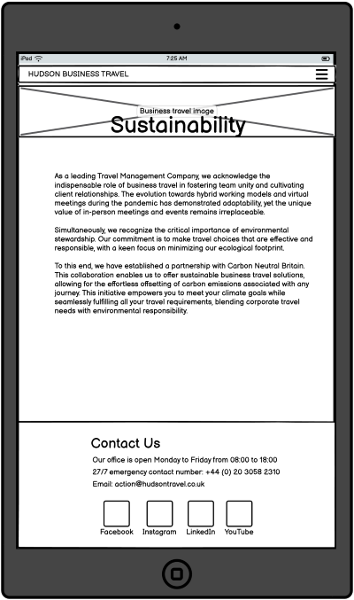

# Hudson Business Travel - Milestone Project 1

## Hudson Business Travel

Hudson Business Travel has established itself as a frontrunner in the corporate travel industry, offering bespoke travel solutions tailored to meet the unique demands of professionals and businesses. Expert in navigating the intricacies of business travel, the company specialises in efficiently managing everything from urgent trips to complex travel itineraries, always focusing on client comfort and convenience. Their commitment to customer-centricity ensures that each travel plan is more than a journey; it’s a customised experience designed to align with their client’s specific business and personal needs.

At the core of Hudson Business Travel’s ethos is a relentless drive for innovation. They integrate the latest technology in travel management, providing advanced booking systems and real-time itinerary tracking to ensure clients are always a step ahead. Hudson Business Travel is synonymous with excellence and integrity in the corporate travel sector, offering more than just travel arrangements. They are a committed partner in their clients’ professional journeys, ensuring every trip is smooth, efficient, and perfectly aligned with business objectives.

### Business Needs

1. Brand Awareness: In today's digital era, an online presence is crucial for reaching a wider audience. A website increases brand visibility and recognition, making Hudson Business Travel known to potential clients who rely on the Internet for corporate travel solutions. It's essential for expanding the company's reach beyond traditional boundaries.
2. Professional Image: A website is often the first point of interaction between a company and its potential clients. A well-designed website conveys a sense of professionalism and legitimacy. It reinforces Hudson Business Travel's image as a reliable and established player in the corporate travel sector, which is vital for building trust with prospective clients.
3. Informational Resource: Providing comprehensive information about services, expertise, and company values is vital to engaging potential clients. A website acts as an always-accessible repository of information, allowing Hudson Business Travel to effectively communicate its offerings, ethos, and strengths, which is essential in informing and attracting potential clients.
4. First Point of Contact: The website is a primary interface for initial enquiries. In a business where first impressions matter, a well-crafted website serves as the initial handshake, offering a glimpse into what Hudson Business Travel is about and how it operates. This is crucial for establishing a positive initial rapport with potential clients.
5. Marketing and Promotion: A website is a powerful marketing tool. It allows Hudson Business Travel to showcase its services and highlight its unique selling points or achievements. In a competitive market, this platform is essential for standing out and effectively communicating the value proposition to potential clients.
6. Competitive Edge: A strong online presence is no longer just an option but a necessity for staying competitive. A website ensures that Hudson Business Travel keeps up with or stays ahead of competitors, demonstrating its commitment to modern business practices and meeting the expectations of digitally savvy clients.

### User Needs

1. Understanding of Services Offered: Users require clear, concise information about the services provided by Hudson Business Travel, such as types of travel management services and support provided.
2. Company Insight: Potential clients and partners look for insights into the company’s ethos, history, and the team’s expertise to gauge reliability and fit.
3. Contact Information: Easy access to contact information is crucial for users considering Hudson Business Travel’s services.
4. Testimonials and Case Studies: Users often seek proof of excellence and reliability through client testimonials, case studies, or success stories.
5. Simple Navigation: A user-friendly website design with simple navigation is essential, allowing users to quickly find the information they need.
6. Corporate Identity and Branding: Users expect the website to reflect the corporate identity of Hudson Business Travel, with professional design and branding that aligns with the company’s image and market position.
7. Sustainability Commitment: Hudson Business Travel wants to showcase its commitment to eco-friendly travel, aligning with industry trends towards environmental responsibility and positioning itself as a progressive, eco-conscious leader in the sector.

## Design Process

### Process

To effectively meet our business goals and cater to the needs of our users, I have planned a four-page, responsive website design. This ensures optimal viewing and interaction experience across all devices, maintaining aesthetics and functionality regardless of screen size.

*Home Page*: Business Travel’s Home Page is designed for immediate impact and user engagement. It features a top navigation bar for seamless site navigation and a compelling hero image that captures the essence of corporate travel. Prominently displayed on the left side of the image is the bold question, “Looking for a new travel management company?” accompanied by a ‘Contact Us’ button to prompt user action. Below this, the “Why Choose Business Travel” section outlines the company’s unique selling points. The footer, consistent across the website, includes social media links and contact details, offering users multiple ways to connect with the company.

*What We Do Page*: This page introduces visitors to the services offered by Business Travel with a header image that sets a professional tone. It includes a detailed section on the company’s services, followed by the “Expertise” area showcasing interactive images. These images, when clicked, reveal more information about specific service areas, enhancing user interaction. The footer, matching the homepage, provides a mix of social media and contact details, ensuring easy access for visitors seeking more information or ways to connect.

*Sustainability Page*: A dedicated Sustainability page, visually introduced by a plant image symbolising commitment to environmentally responsible travel. This page succinctly presents the company’s eco-friendly initiatives and collaboration with Carbon Neutral Britain, emphasising their focus on sustainable corporate travel solutions. Consistent with the site’s design, the footer on this page contains social media links and contact information, offering easy connectivity and further engagement opportunities for users.

*Who We Are Page*: The ‘Who We Are’ page starts with a consistent header image, maintaining the website’s visual theme. This page focuses on introducing the team, featuring photos and bios of key personnel, and adding a personal and credible touch to the brand. The company’s vision and values are also highlighted, further establishing the corporate identity. The footer, aligned with other pages, combines social media links with contact information, facilitating accessible communication.

*Contact Us Page*: Designed for direct user interaction, the ‘Contact Us’ page features a straightforward layout with a header image in line with the site’s theme. Central to this page is a contact form complemented by the company’s address, contact number, and an integrated Google Maps location. The footer, uniform across the site, includes contact details and social media links, providing users with multiple channels to contact Business Travel.

### Colour Palette

### Wire Frame

#### Web layout

### Tablet layout

### Phone layout

## Technoligy used

HTML5 / CSS3

Bootstrap V5

Chat GPT to help troubleshoot and learn why things were behaving in a certain way.

I learnt a few tricks with CSS when I first started practicing coding with [Free Code Camp](https://www.freecodecamp.org/) which has helped me in this course.

## Issues/Bugs

Creating the fade on the heror image. I used Linear Gradient which I learnt when I first started learn about CSS with [Free Code Camp](https://www.freecodecamp.org/).
I had to troubleshoot because my text was also being faded out and I used chat GPT which I found I needed to add a z-index to my css.

After adding the nav menu, the image moved down but the fade didn't. I used google dev tool and played with margins and padding but it didn't work. Asked chat GPT and learned that I needed to adjust the .hero-img::before top proprty to aline again.

I had massive issues with creating media queries. I really struggled to the content to look good on smaller screens, in particual with the question-section and question-button. The position on smaller screans were good on one size, and not great as it increased, or viser versa. I used Chat GPT a lot to help me troubleshoot, which I don't think help huge amount, until I decided to change the html and wrap the question-section and question-button in a div. Only then, the position work better.

I had issues with the meet the team section and the photos i was adding. I used Chat GPT but still coudln't get it to look how i wanted it to. I intially used the img selector but after not be able to get the positing correct, i moved the imgages to the sytle.css file. I copied what i did for the what we do section and change the border raides so the images were round.

On the contact us page, I wanted to add a google maps in iframe selector, but very quickly released that it didn't work as planed. After doing some research, I found that I needed an google API which I looked into, created one and added to my page.

After completing my website, I decided to do it all over again because the css was very messy, and I also wanted to structure the html a bit better. One of the things I wanted to do was ensure the navbar stuck to the top of screen and wasn't past of hero image. But now that i've redone that, the nav bar isn't sticking to the top. I kept using the bootstrap class sticky-top and it wasn't working. I often would leave it, work on something else, and come back to it. But no matter what I did, it would not work. I decided that I needed use tutor assistance and spoke with Sarah. She started working on my issue and sent me a screenshot of my navbar below my hero img, and that is when the penny dropped. What if I use position and fixed instead, looked up fixed in bootstrap and got the correct class name, added it, and it worked!

I ran my HTMl through W3C markup validation server and recevied an error which was from the button on the home page which I copied from Bootstap. I used Chat GPT to understant what the error meant, and it was adiving that the "a" tag on the home is used for creating links, and it does not use the type attribute for defining its behaviour which I had, type="button". I therefore removed the attribute.

## Deployment

1. Visit [GitHub](https://github.com/).
2. Navigated to my [Hudson Business Travel Repository](https://github.com/Ty-Thetravelguy/hudson-business-travel-milestone-project-1).
3. Click settings along the top options bar.
4. Click pages found on the left under "code and automation".
5. Under "Branch", I changed it from none to main, and saved.
6. Refershed the screen and the link was provided at the top of the screen.
